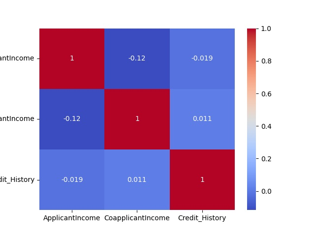
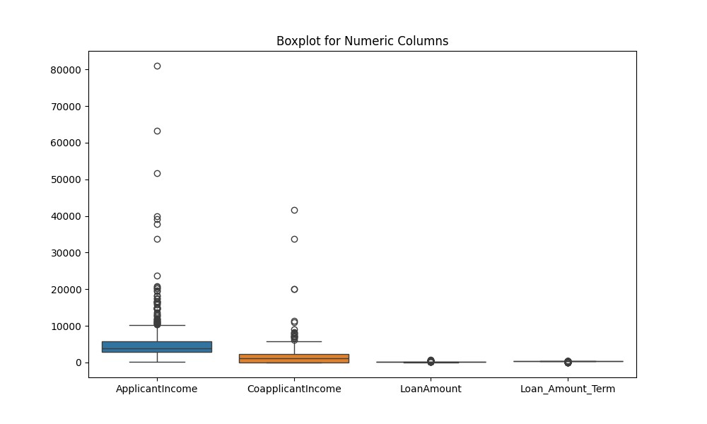

# 🏦 Loan Prediction using Logistic Regression

## Overview
The **Loan Prediction System** predicts whether a loan applicant is likely to get approval or not using **Logistic Regression**.  
This model helps financial institutions automate the loan approval process and make data-driven decisions.

---

## Dataset
The dataset contains historical loan applicant information.

| Feature | Description |
|---------|-------------|
| Gender | Male / Female |
| Married | Yes / No |
| Dependents | Number of dependents |
| Education | Graduate / Not Graduate |
| Self_Employed | Yes / No |
| ApplicantIncome | Applicant’s income |
| CoapplicantIncome | Co-applicant’s income |
| LoanAmount | Loan amount in thousands |
| Loan_Amount_Term | Loan term in months |
| Credit_History | 1 = good, 0 = bad |
| Property_Area | Urban / Rural / Semiurban |
| Loan_Status | Target variable (Y = Approved, N = Not Approved) |

---

## Steps

1. **Load the Dataset**
   - Import CSV file using Pandas.
2. **Data Cleaning**
   - Handle missing values using mean/median/mode imputation.
   - Convert categorical variables into numeric using LabelEncoder.
3. **Exploratory Data Analysis (EDA)**
   - Visualize distributions and relationships using Matplotlib/Seaborn.
   **Correlation Between The Numeric Columns**
   
   - Detect outliers in numeric columns.
4. **Feature Engineering**
   - Scale numeric features if required.
5. **Model Building**
   - Train Logistic Regression model.
6. **Evaluation**
   - Evaluate using Accuracy, Precision, Recall, F1-score.
7. **Prediction**
   - Predict loan approval for new applicants.

---

## Data Visualization

**Boxplot of Outliers**

**Box Plot After Replacing All The Outliers**

---

## Results

| Metric | Score |
|--------|-------|
| Accuracy | 81% |
| Precision | 0.82 |
| Recall | 0.79 |
| F1-Score | 0.80 |

---

## Handling Outliers
- Numeric outliers were detected in **ApplicantIncome, CoapplicantIncome, LoanAmount**.  
- Outliers were handled using **clipping (IQR method)** to retain all rows while reducing extreme values.

---

## Future Work
- Deploy a **Streamlit web app** for user input.  
- Compare Logistic Regression with **Random Forest** and **XGBoost** models.  
- Optimize performance using **hyperparameter tuning**.

---

## Contact
📧 Email: projectmail877@gmail.com   

## 🤝 Contributors
- Gobi M-Machine Learning Engineer

---

